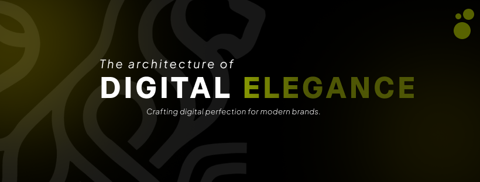

  <!-- Cover Banner (cover.png in root folder) -->
  

  <!-- Logo and Animated Tagline -->
  
  
  

    
  

  <!-- Action Pills -->
  

    
    
    
  

---

### 🌟 Welcome to SinhaForge

  

    We are a next-generation digital startup bridging the gap between high-performance engineering and breathtaking visual design. Every product we build is crafted with obsessive attention to detail, optimized for speed, and structured for absolute scalability.
  

---

### ⚡ What We Do

| Service | Technology Focus | Description |
| :--- | :--- | :--- |
| **🌐 Web Development** | `Next.js 16` / `React 19` | Hyper-fast, responsive web applications engineered for optimal speed and search indexing. |
| **📱 Mobile Apps** | `Cross-Platform` | Native-feel mobile applications built for fluid micro-interactions and seamless user experience. |
| **🎨 UI/UX Design** | `Figma` / `Tailwind` | High-contrast, dark-mode focused interfaces designed around modern user psychology. |
| **🧊 Low Poly 3D** | `Blender` | Custom-crafted low-poly 3D assets, environments, and immersive visual components. |
| **📱 Social Media Design** | `Brand Assets` | High-impact promotional content and social media creatives that elevate modern brands. |

---

### 🛠 Tech & Tooling Stack

---

  

